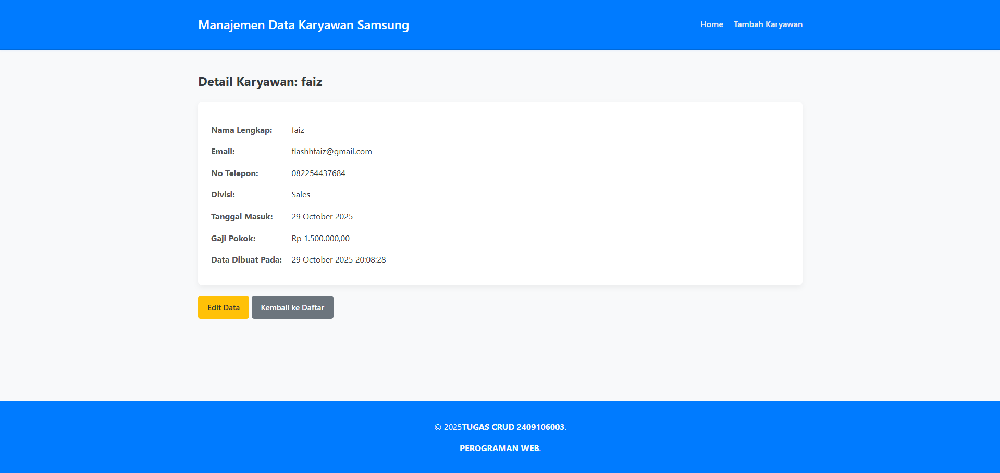

# Aplikasi CRUD Manajemen Karyawan

Aplikasi web sederhana untuk mengelola data karyawan (Create, Read, Update, Delete) yang dibuat menggunakan PHP Native dan koneksi database PDO.

## Fitur yang Tersedia

* **Create:** Menambah data karyawan baru melalui form dengan validasi.
* **Read (List):** Menampilkan daftar semua karyawan dalam tabel dengan pagination (5 data per halaman).
* **Read (Detail):** Menampilkan halaman detail untuk satu karyawan.
* **Update:** Mengedit data karyawan yang sudah ada.
* **Delete:** Menghapus data karyawan (dengan konfirmasi modal yang interaktif).
* **Pencarian:** Mencari karyawan berdasarkan Nama, Email, atau Divisi.
* **Pagination:** Membagi daftar karyawan menjadi beberapa halaman.
* **Validasi:** Validasi input di sisi server (wajib diisi, format email, dropdown, dll).
* **Keamanan:** Menggunakan PDO Prepared Statements (anti-SQL Injection) dan `htmlspecialchars()` (anti-XSS).
* **Pesan Notifikasi:** Menampilkan pesan sukses atau error yang interaktif (hilang otomatis dan bisa ditutup).

## Kebutuhan Sistem

* PHP minimal versi 8.0
* Database: MySQL
* Web Server: Laragon (direkomendasikan) atau XAMPP.
* Browser Web (Chrome, Firefox, dll).

## Cara Instalasi dan Konfigurasi

1.  **Salin Folder & File**
    * Salin semua folder (`assets/`, `config/`, `includes/`) dan file (`index.php`, `create.php`, dll.) ke dalam direktori `C:\laragon\www\`.

2.  **Buat Database**
    * Buka Laragon, klik **"Start All"**.
    * Klik tombol **"Database"** (HeidiSQL).
    * Buat database baru dengan nama: **`db_karyawan`**.
    * Pilih database `db_karyawan`, buka tab **"Query"**, dan jalankan SQL berikut:
        ```sql
        CREATE TABLE employees (
            id INT AUTO_INCREMENT PRIMARY KEY,
            nama_lengkap VARCHAR(100) NOT NULL,
            email VARCHAR(100) NOT NULL UNIQUE,
            no_telepon VARCHAR(20) NULL,
            divisi VARCHAR(50) NOT NULL,
            tanggal_masuk DATE NOT NULL,
            gaji DECIMAL(15, 2) NOT NULL,
            created_at TIMESTAMP DEFAULT CURRENT_TIMESTAMP 
        );
        ```

3.  **Konfigurasi Koneksi**
    * Buka file `config/database.php`. Pastikan pengaturannya sudah sesuai dengan server lokal Anda (lihat contoh di bawah).

4.  **Jalankan Aplikasi**
    * Buka browser dan akses: `http://localhost/`

## Struktur Folder

Struktur file dan folder diletakkan langsung di dalam `www` root agar dapat meenjalankan php.

```
/www/
├── config/
│   └── database.php
│
├── includes/
│   ├── header.php
│   └── footer.php
│
├── index.php
├── create.php
├── save.php
├── edit.php
├── update.php
├── detail.php
├── delete.php
│
├── assets/
│   ├── css/
│   │   └── style.css
│   └── js/
│       └── script.js
│
└── README.md


```
## Contoh Environment Config

Konfigurasi koneksi diatur di dalam file `config/database.php`:

```php
<?php
// File: config/database.php

// Konfigurasi database
$db_host = 'localhost';   // Sesuaikan dengan host Anda
$db_name = 'db_karyawan'; // Sesuaikan dengan nama database Anda
$db_user = 'root';        // Sesuaikan dengan username database Anda
$db_pass = '';            // Sesuaikan dengan password database Anda

```
## Screenshot Aplikasi

Berikut adalah beberapa screenshot dari aplikasi:

### 1. Tampilan Awal (Daftar Karyawan)


### 2. Halaman Tambah Data


### 3. Fitur Pencarian


### 4. Halaman Detail Karyawan


### 5. Halaman Update Data


### 6. Notifikasi Sukses
Notifikasi akan muncul setelah berhasil memperbarui atau menghapus data.

